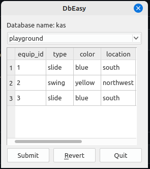

# Qt PostgreSQL 

This is a base program to connect to PostgreSQL database by using QPSQL driver with the ability to view and edit table cell values (**Qt/C++, Linux**).

## Opening

Open project in Qt Creator
To open a project:  
    1. Select File > Open File or Project (Ctrl+O or Cmd+O on macOS) and select the project file for the project to open: .pro (qmake). \
    2. In the Configure Project tab, select kits for building and running your project.\
    3. Select Configure Project.
or go to the folder with the .pro-file and execute:   
    ```
    qmake -o Makefile DbEasy.pro
    ```   
    ```
    make
    ```
## Usage

In terminal with the executable file do: ./bin/debug/DbEasy -h
```
Usage: ./DbEasy [options]
Test the database connection and edit the data in the tables if you like.

Options:
  --host <host>          The hostname server to use.
  --port <port>          The server port.
  --db <db name>         The database name.
  -u <user>              The username.
  --password <password>  The password.
  -h, --help             Displays help on commandline options.
  --help-all             Displays help including Qt specific options.
  -v, --version          Displays version information.
```
For example:   
```
./DbEasy --host 127.0.0.1 --port 5432 --db kas -u postgres --password 123456
```
## Program Appearance:
<p align="center">
  
</p>
